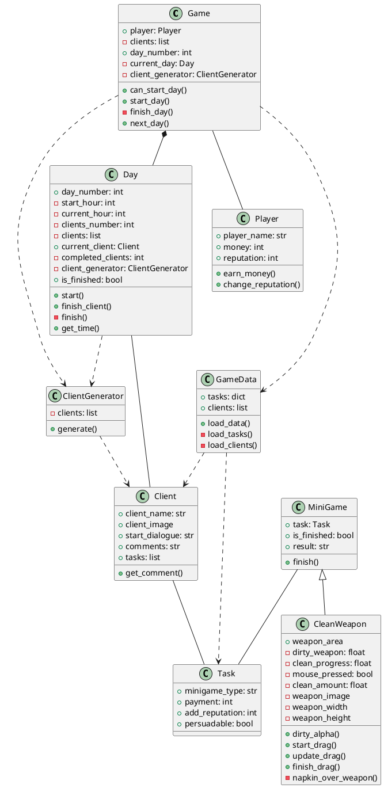

```plantuml
@startuml

class Game{
+ player: Player
- clients: list
+ day_number: int
- current_day: Day
- client_generator: ClientGenerator
+ can_start_day()
+ start_day()
- finish_day()
+ next_day()
}

class Day{
+ day_number: int
- start_hour: int
- current_hour: int
- clients_number: int
- clients: list
+ current_client: Client
- completed_clients: int
- client_generator: ClientGenerator
+ is_finished: bool
+ start()
+ finish_client()
- finish()
+ get_time()
}

class ClientGenerator{
- clients: list
+ generate()
}

class Player {
+ player_name: str
+ money: int
+ reputation: int
+ earn_money()
+ change_reputation()
}

class Task{
+ minigame_type: str
+ payment: int
+ add_reputation: int
+ persuadable: bool
}

class Client {
+ client_name: str
+ client_image
+ start_dialogue: str
+ comments: str
+ tasks: list
+ get_comment()
}

class MiniGame {
+ task: Task
+ is_finished: bool
+ result: str
+ finish()
}

class CleanWeapon{
+ weapon_area
- dirty_weapon: float
- clean_progress: float
- mouse_pressed: bool
- clean_amount: float
- weapon_image
- weapon_width
- weapon_height
+ dirty_alpha()
+ start_drag()
+ update_drag()
+ finish_drag()
- napkin_over_weapon()
}

class GameData {
+ tasks: dict
+ clients: list
+ load_data()
-load_tasks()
- load_clients()
}

MiniGame <|-- CleanWeapon
Game -- Player
Client -- Task
Day -- Client
MiniGame -- Task
Game *-- Day
Game ..> ClientGenerator
Day ..> ClientGenerator
ClientGenerator ..> Client
GameData ..> Task
GameData ..> Client
Game ..> GameData

@enduml
```
