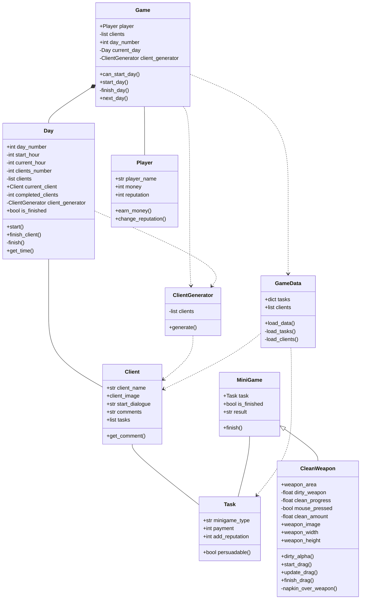

```mermaid
classDiagram
    class Game {
        +Player player
        -list clients
        +int day_number
        -Day current_day
        -ClientGenerator client_generator
        +can_start_day()
        +start_day()
        -finish_day()
        +next_day()
    }

    class Day {
        +int day_number
        -int start_hour
        -int current_hour
        -int clients_number
        -list clients
        +Client current_client
        -int completed_clients
        -ClientGenerator client_generator
        +bool is_finished
        +start()
        +finish_client()
        -finish()
        +get_time()
    }

    class ClientGenerator {
        -list clients
        +generate()
    }

    class Player {
        +str player_name
        +int money
        +int reputation
        +earn_money()
        +change_reputation()
    }

    class Task {
        +str minigame_type
        +int payment
        +int add_reputation
        +bool persuadable()
    }

    class Client {
        +str client_name
        +client_image
        +str start_dialogue
        +str comments
        +list tasks
        +get_comment()
    }

    class MiniGame {
        +Task task
        +bool is_finished
        +str result
        +finish()
    }

    class CleanWeapon {
        +weapon_area
        -float dirty_weapon
        -float clean_progress
        -bool mouse_pressed
        -float clean_amount
        +weapon_image
        +weapon_width
        +weapon_height
        +dirty_alpha()
        +start_drag()
        +update_drag()
        +finish_drag()
        -napkin_over_weapon()
    }

    class GameData {
        +dict tasks
        +list clients
        +load_data()
        -load_tasks()
        -load_clients()
    }

    MiniGame <|-- CleanWeapon
    Game -- Player
    Client -- Task
    Day -- Client
    MiniGame -- Task
    Game *-- Day
    Game ..> ClientGenerator
    Day ..> ClientGenerator
    ClientGenerator ..> Client
    GameData ..> Task
    GameData ..> Client
    Game ..> GameData
```
